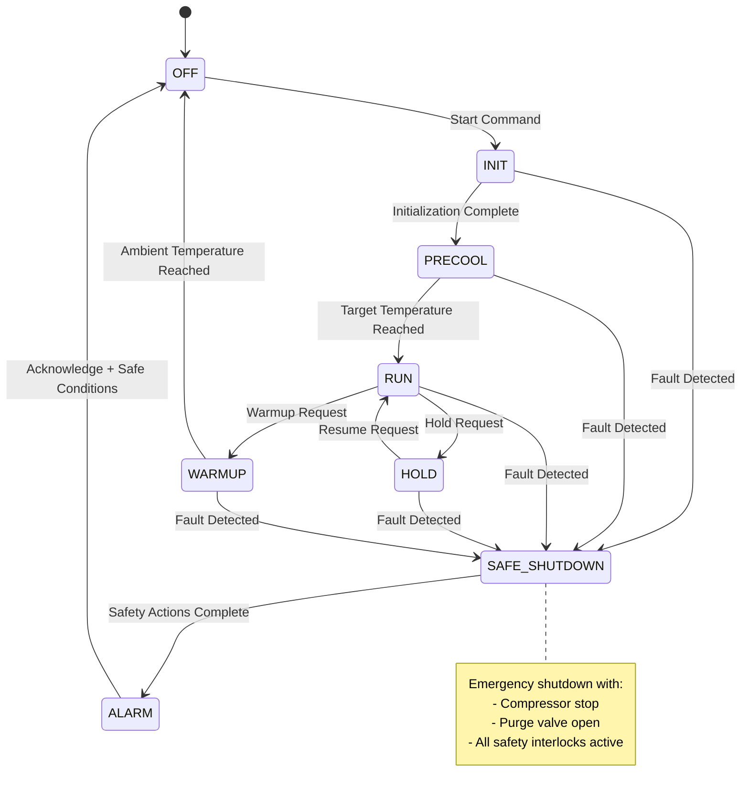

# Design Document

## Overview

DCM Cryo Cooler 제어로직 시뮬레이터는 실제 빔라인 DCM(Double Crystal Monochromator) Cryo Cooler 시스템의 완전한 디지털 트윈을 제공하는 통합 플랫폼입니다. 이 시스템은 Bruker 크라이오쿨러 매뉴얼과 제어 아키텍처 분석을 기반으로 하여 상태기계 기반 제어로직, 물리적 시뮬레이션, EPICS 기반 제어 인터페이스, CSS Phoebus GUI, 그리고 포괄적인 테스트 프레임워크를 통합합니다.

**Reference 문서 기반 설계**:
- **Controller Architecture Analysis**: 제어 아키텍처 요구사항 및 명세
- **DCM CryoCooler Proportional Control Valve**: 비례제어밸브 사양
- **Bruker Cryo Cooler Manual**: 실제 하드웨어 운영 매뉴얼
- **Cryocooler Seminar Diagnosis**: 진단 및 문제해결 가이드
- **System Diagram**: DCM 크라이오쿨러 시스템 배관도 (Cryocooler_image1.png)

시스템의 핵심 설계 원칙은 다음과 같습니다:
- **안전 우선**: 모든 비정상 상황에서 안전한 상태로 전환
- **실제 하드웨어 반영**: Bruker 매뉴얼 기반의 정확한 물리 모델링
- **모듈화**: 각 구성요소의 독립적 개발과 테스트 지원 (요구사항 7)
- **표준 준수**: EPICS 표준과 빔라인 제어 시스템 규약 준수
- **검증 가능성**: 자동화된 테스트와 검증 도구 제공
- **다국어 지원**: 한국어 기반 사용자 인터페이스 및 문서화
- **실시간 성능**: 실시간 및 가속 시뮬레이션 모드 지원

## Architecture

### System Architecture

```mermaid
graph TB
    subgraph "Test Harness Layer"
        TH[Test Harness<br/>Python + pyepics/p4p]
        SC[Scenario Runner]
        FZ[Fuzzer]
        PT[Property Tests]
    end
    
    subgraph "GUI Layer"
        GUI[CSS Phoebus GUI<br/>.bob files]
        MAIN[Main Dashboard]
        SYN[Synoptic View<br/>Based on System Diagram]
    end
    
    subgraph "Control Layer"
        IOC[EPICS IOC<br/>softIOC + DB + SNL]
        PV[Process Variables]
        SNL[State Notation Logic]
        PCV[Proportional Control Valve]
    end
    이 EPICS 
    subgraph "Simulation Layer"
        SIM[Simulator Core<br/>C/Python]
        PHY[Bruker Physics Model]
        FAULT[Fault Injection & Diagnosis]
    end
    
    subgraph "Hardware Abstraction - DCM Cryo System"
        COMP[Compressor Motor]
        VALVE[Control Valves<br/>V9,V15,V19,V20,V21,V24]
        SENSOR[Temperature Sensors<br/>T5,T6,PT1,PT3,LT19,LT23]
        COOL[Cold Head & Heater]
        PUMP[Circulation Pump]
        FILTER[N2 Gas Filter]
        HEATER[Heater Vessel & Line]
        LN2[LN2 Supply System]
    end
    
    TH -.->|PV Access| IOC
    GUI -->|CA/PVA| IOC
    IOC -->|Control Commands| SIM
    SIM -->|Sensor Data| IOC
    SIM -->|Physical Simulation| HARDWARE
    
    SC --> TH
    FZ --> TH
    PT --> TH
    
    MAIN --> GUI
    SYN --> GUI
    
    PV --> IOC
    SNL --> IOC
    PCV --> IOC
    
    PHY --> SIM
    FAULT --> SIM
    
    COMP --> HARDWARE
    VALVE --> HARDWARE
    SENSOR --> HARDWARE
    COOL --> HARDWARE
    PUMP --> HARDWARE
    FILTER --> HARDWARE
    HEATER --> HARDWARE
    LN2 --> HARDWARE
```

### DCM Cryo Cooler System Layout (Based on Reference Diagram)

시스템은 다음과 같은 주요 구성요소로 이루어져 있습니다:

**냉각 시스템**:
- DCM Crystal 냉각을 위한 메인 냉각 루프
- Sub-cooler line을 통한 보조 냉각
- LN2 Supply를 통한 극저온 냉각

**제어 밸브 시스템**:
- V9: Purge 밸브 (안전 배출)
- V15, V19: LN2 공급 제어 밸브
- V20: Heater line 제어 밸브  
- V21: 메인 제어 밸브
- V24: Overflow 제어 밸브
- CV10, CV11, CV17: 체크 밸브

**센서 시스템**:
- T5, T6: 온도 센서
- PT1, PT3: 압력 센서
- LT19, LT23: 액체 레벨 센서
- FT18: 유량 센서

**안전 시스템**:
- Safety valve (0.5bar 설정)
- Purge 시스템
- Heater vessel 과열 방지
- N2 gas vent 시스템

### State Machine Architecture



## Components and Interfaces

### 1. Simulator Core

**Purpose**: 물리적 크라이오 쿨러 시스템의 동적 특성을 시뮬레이션

**Key Components**:
- **Physics Engine**: 열역학적 모델링 (1차/2차 열용량, 열전달) - 요구사항 4.1, 4.2
- **Sensor Simulation**: 온도, 압력, 유량 센서의 현실적 응답 - 요구사항 4.4
- **Fault Injection**: 다양한 고장 상황 시뮬레이션 - 요구사항 4.5
- **Time Management**: 실시간 또는 가속 시뮬레이션 - 요구사항 4.6
- **Configuration Management**: 런타임 설정 변경 지원 - 요구사항 7.5

**Module Independence Design** (요구사항 7.1, 7.2):
시뮬레이터 코어는 완전히 독립적인 모듈로 설계되어 다음과 같은 표준 인터페이스를 제공합니다:
- **gRPC Interface**: 고성능 실시간 통신
- **CLI Interface**: 스크립트 및 자동화 도구 연동
- **Configuration API**: 동적 설정 변경

**Interfaces**:
```python
class CryoSimulator:
    """DCM 크라이오 쿨러 시뮬레이터 메인 클래스"""
    
    def __init__(self, config: SimConfig):
        self.physics_model = ThermalModel(config.thermal_params)
        self.sensors = SensorArray(config.sensor_params)
        self.faults = FaultInjector()
        self.time_manager = TimeManager(config.time_scale)  # 요구사항 4.6
        self.config_manager = ConfigManager()  # 요구사항 7.5
        
    def step(self, dt: float, commands: ControlCommands) -> SensorReadings:
        """단일 시뮬레이션 스텝 실행"""
        # 시간 스케일링 적용
        scaled_dt = self.time_manager.scale_time(dt)
        return self.physics_model.update(scaled_dt, commands)
    
    def inject_fault(self, fault_type: str, parameters: dict):
        """특정 고장 상황 주입 - 요구사항 4.5"""
        self.faults.inject(fault_type, parameters)
    
    def get_state(self) -> SimulatorState:
        """현재 시뮬레이션 상태 반환"""
        return self.physics_model.get_current_state()
    
    def update_config(self, new_config: dict) -> bool:
        """런타임 설정 업데이트 - 요구사항 7.5"""
        return self.config_manager.update_runtime_config(new_config)
    
    def set_time_scale(self, scale: float) -> bool:
        """시간 스케일 동적 조정 - 요구사항 4.6"""
        return self.time_manager.set_scale(scale)
```

**Physics Model (Based on Bruker Manual & System Diagram)**:
```python
class BrukerCryoModel:
    def __init__(self, config: CryoConfig):
        # Thermal parameters from Bruker specifications
        self.T_coldhead = 300.0      # Current cold head temperature [K]
        self.T_heater_vessel = 300.0 # Heater vessel temperature [K]
        self.T_dcm_crystal = 300.0   # DCM crystal temperature [K]
        
        # Thermal capacities (from Bruker manual)
        self.C_coldhead = 800.0      # Cold head thermal capacity [J/K]
        self.C_heater = 1200.0       # Heater vessel capacity [J/K]
        self.C_crystal = 400.0       # DCM crystal capacity [J/K]
        
        # Time constants
        self.tau_env = 120.0         # Environmental time constant [s]
        self.tau_transfer = 30.0     # Heat transfer time constant [s]
        
        # LN2 system parameters
        self.ln2_flow_rate = 0.0     # LN2 flow rate [L/min]
        self.ln2_level = 100.0       # LN2 level [%]
        self.ln2_temp = 77.0         # LN2 temperature [K]
        
        # Pressure system
        self.p_high = 15.0           # High pressure side [bar]
        self.p_low = 1.0             # Low pressure side [bar]
        
        # Valve positions (0-100%)
        self.valve_positions = {
            'V9': 0.0,   # Purge valve
            'V15': 0.0,  # LN2 supply valve 1
            'V19': 0.0,  # LN2 supply valve 2
            'V20': 0.0,  # Heater line valve
            'V21': 0.0,  # Main control valve
            'V24': 0.0   # Overflow valve
        }
        
    def update(self, dt: float, commands: ControlCommands) -> SensorReadings:
        """
        Multi-zone thermal model with LN2 cooling and heater control
        """
        # Update valve positions
        self.update_valve_positions(commands)
        
        # Calculate cooling power from LN2 system
        Q_ln2_cooling = self.calculate_ln2_cooling()
        
        # Calculate heater power
        Q_heater = self.calculate_heater_power(commands.heater_setpoint)
        
        # Environmental heat load
        Q_env_load = self.calculate_environmental_load()
        
        # Update temperatures using multi-zone model
        self.update_temperatures(dt, Q_ln2_cooling, Q_heater, Q_env_load)
        
        # Update pressure system
        self.update_pressure_system(dt)
        
        # Update LN2 system
        self.update_ln2_system(dt)
        
        return self.get_sensor_readings()
    
    def calculate_ln2_cooling(self) -> float:
        """Calculate cooling power from LN2 system based on valve positions"""
        # LN2 flow depends on V15 and V19 valve positions
        ln2_flow_factor = (self.valve_positions['V15'] + self.valve_positions['V19']) / 200.0
        
        # Cooling power calculation (simplified)
        if ln2_flow_factor > 0:
            # Latent heat of vaporization for LN2: ~200 kJ/kg
            cooling_power = ln2_flow_factor * 50.0  # Max 50W cooling
        else:
            cooling_power = 0.0
            
        return cooling_power
    
    def calculate_heater_power(self, heater_setpoint: float) -> float:
        """Calculate heater power based on setpoint and V20 valve position"""
        if self.valve_positions['V20'] > 0:
            # Heater power proportional to valve opening and setpoint
            heater_power = (self.valve_positions['V20'] / 100.0) * heater_setpoint
        else:
            heater_power = 0.0
            
        return heater_power
    
    def update_temperatures(self, dt: float, Q_cooling: float, Q_heater: float, Q_load: float):
        """Update all temperature zones"""
        T_env = 300.0  # Ambient temperature
        
        # Cold head temperature dynamics
        dT_coldhead = ((T_env - self.T_coldhead) / self.tau_env - 
                      Q_cooling / self.C_coldhead + 
                      Q_load / self.C_coldhead) * dt
        self.T_coldhead += dT_coldhead
        
        # Heater vessel temperature
        dT_heater = ((self.T_coldhead - self.T_heater_vessel) / self.tau_transfer +
                    Q_heater / self.C_heater) * dt
        self.T_heater_vessel += dT_heater
        
        # DCM crystal temperature (coupled to cold head)
        dT_crystal = ((self.T_coldhead - self.T_dcm_crystal) / self.tau_transfer) * dt
        self.T_dcm_crystal += dT_crystal
        
        # Apply physical limits
        self.T_coldhead = max(self.ln2_temp, self.T_coldhead)
        self.T_heater_vessel = max(self.T_coldhead, self.T_heater_vessel)
        self.T_dcm_crystal = max(self.T_coldhead, self.T_dcm_crystal)
```

### 2. EPICS IOC

**Purpose**: 표준 EPICS 인터페이스를 통한 제어 시스템 통합 (요구사항 2)

**Key Components**:
- **Database Records**: 모든 제어점과 모니터링 포인트 정의 - 요구사항 2.1, 2.2
- **State Notation Logic (SNL)**: 상태기계 구현 - 요구사항 1.1~1.6
- **Device Support**: 시뮬레이터와의 통신 인터페이스 - 요구사항 2.4, 2.5
- **Korean Language Support**: 한국어 알람 메시지 및 상태 표시

**Module Independence** (요구사항 7.1, 7.2):
EPICS IOC는 독립적인 프로세스로 실행되며 다음 인터페이스를 통해 통신합니다:
- **Channel Access/PV Access**: 표준 EPICS 프로토콜
- **Asyn Driver**: 시뮬레이터와의 비동기 통신
- **SNL State Machine**: 독립적인 상태 관리

**PV Naming Convention**: `BL:DCM:CRYO:{SIGNAL}:{ATTRIBUTE}`

**Core PV Structure (Based on System Diagram)**:
```
# State Control
BL:DCM:CRYO:STATE          # Current state (mbbi/mbbo)
BL:DCM:CRYO:CMD:START      # Start command (bo)
BL:DCM:CRYO:CMD:STOP       # Stop command (bo)
BL:DCM:CRYO:CMD:HOLD       # Hold command (bo)
BL:DCM:CRYO:CMD:RESUME     # Resume command (bo)

# Temperature Control & Monitoring
BL:DCM:CRYO:T:SP           # Temperature setpoint (ao)
BL:DCM:CRYO:T:CHEAD:RBV    # Cold head temperature (ai)
BL:DCM:CRYO:T:AMB:RBV      # Ambient temperature (ai)
BL:DCM:CRYO:T5:RBV         # Temperature sensor T5 (ai)
BL:DCM:CRYO:T6:RBV         # Temperature sensor T6 (ai)

# Pressure Monitoring
BL:DCM:CRYO:PT1:RBV        # Pressure sensor PT1 (ai)
BL:DCM:CRYO:PT3:RBV        # Pressure sensor PT3 (ai)
BL:DCM:CRYO:P:HIGH:RBV     # High pressure side (ai)
BL:DCM:CRYO:P:LOW:RBV      # Low pressure side (ai)

# Level Monitoring
BL:DCM:CRYO:LT19:RBV       # Level sensor LT19 (ai)
BL:DCM:CRYO:LT23:RBV       # Level sensor LT23 (ai)

# Flow Control
BL:DCM:CRYO:FT18:RBV       # Flow sensor FT18 (ai)
BL:DCM:CRYO:F:FLOW:RBV     # Gas flow rate (ai)
BL:DCM:CRYO:F:MIN          # Minimum flow threshold (ao)

# Valve Control (Based on System Diagram)
BL:DCM:CRYO:V9:CMD         # Purge valve V9 (bo)
BL:DCM:CRYO:V15:CMD        # LN2 supply valve V15 (bo)
BL:DCM:CRYO:V19:CMD        # LN2 supply valve V19 (bo)
BL:DCM:CRYO:V20:CMD        # Heater line valve V20 (bo)
BL:DCM:CRYO:V21:CMD        # Main control valve V21 (bo)
BL:DCM:CRYO:V24:CMD        # Overflow valve V24 (bo)

# Equipment Control
BL:DCM:CRYO:COMP:CMD       # Compressor motor on/off (bo)
BL:DCM:CRYO:COMP:STS       # Compressor status (bi)
BL:DCM:CRYO:PUMP:CMD       # Circulation pump (bo)
BL:DCM:CRYO:HEATER:CMD     # Heater control (ao)

# Safety & Alarm System (요구사항 6)
BL:DCM:CRYO:SAFETY:VALVE   # Safety valve status (bi)
BL:DCM:CRYO:ALARM          # Alarm status (bi)
BL:DCM:CRYO:ACK:ALM        # Alarm acknowledge (bo)
BL:DCM:CRYO:ALARM:MSG      # Alarm message (stringin) - 한국어 지원
BL:DCM:CRYO:ALARM:MSG:EN   # Alarm message English (stringin)
BL:DCM:CRYO:INTERLOCK      # Safety interlock status (bi)

# LN2 Supply System
BL:DCM:CRYO:LN2:SUPPLY     # LN2 supply status (bi)
BL:DCM:CRYO:LN2:LEVEL      # LN2 level (ai)

# Proportional Control Valve (Based on Reference Doc)
BL:DCM:CRYO:PCV:SP         # PCV setpoint (ao)
BL:DCM:CRYO:PCV:POS        # PCV position feedback (ai)
BL:DCM:CRYO:PCV:MODE       # PCV control mode (mbbo)
```

**SNL State Machine Implementation**:
```c
program dcm_cryo_control
option +r;  /* reentrant */

/* PV declarations */
int state; assign state to "BL:DCM:CRYO:STATE";
int cmd_start; assign cmd_start to "BL:DCM:CRYO:CMD:START";
double t_sp; assign t_sp to "BL:DCM:CRYO:T:SP";
double t_chead; assign t_chead to "BL:DCM:CRYO:T:CHEAD:RBV";
int alarm; assign alarm to "BL:DCM:CRYO:ALARM";

ss main_control {
    state OFF {
        when (cmd_start && !alarm) {
            printf("Starting initialization sequence\n");
            state = 1; /* INIT */
            pvPut(state);
        } state INIT
    }
    
    state INIT {
        when (efTestAndClear(t_chead) && t_chead < 250.0) {
            printf("Initialization complete, starting precool\n");
            state = 2; /* PRECOOL */
            pvPut(state);
        } state PRECOOL
        
        when (alarm) {
            printf("Fault during initialization\n");
            state = 7; /* SAFE_SHUTDOWN */
            pvPut(state);
        } state SAFE_SHUTDOWN
    }
    
    state PRECOOL {
        when (t_chead <= t_sp + 5.0) {
            printf("Target temperature reached, entering RUN\n");
            state = 3; /* RUN */
            pvPut(state);
        } state RUN
        
        when (alarm) {
            state = 7; /* SAFE_SHUTDOWN */
            pvPut(state);
        } state SAFE_SHUTDOWN
    }
    
    /* Additional states... */
}
```

### 3. CSS Phoebus GUI

**Purpose**: 운영자를 위한 직관적인 그래픽 사용자 인터페이스 (요구사항 3)

**Korean Language Support**: 모든 GUI 요소는 한국어로 표시되며, 필요시 영어 병행 표기

**Module Independence** (요구사항 7.1, 7.2):
GUI는 완전히 독립적인 클라이언트로 동작하며 EPICS PV를 통해서만 통신합니다.

**Key Screens**:

**Main Dashboard (main.bob)** - 요구사항 3.1, 3.2, 3.4:
- 시스템 상태 표시기 (색상 코딩): 정지/초기화/예냉/운전/대기/승온/알람/안전정지
- 온도 트렌드 차트: T5, T6, 냉각헤드 온도 실시간 표시
- 압력 모니터링: PT1, PT3 압력 센서 데이터
- 레벨 모니터링: LT19, LT23 액체 레벨 표시
- 유량 모니터링: FT18 유량 센서 데이터
- 제어 버튼: 시작/정지/대기/재개 (한국어 라벨)
- 알람 패널: 한국어 알람 메시지 및 확인 기능
- 주요 성능 지표 (KPI) 표시
- LN2 공급 상태 및 레벨 표시

**Synoptic View (synoptic.bob) - Based on Cryocooler_image1.png**:
- Complete DCM cryo cooler system layout
- Real-time valve positions (V9, V15, V19, V20, V21, V24)
- Check valve status (CV10, CV11, CV17)
- Temperature readings at all sensor points (T5, T6)
- Pressure readings (PT1, PT3)
- Level indicators (LT19, LT23)
- Flow indication (FT18)
- Compressor motor status
- Circulation pump status
- Heater vessel and line status
- LN2 supply system visualization
- Safety valve indication
- Purge system status
- Insulation layer representation
- Sub-cooler line flow indication
- N2 gas vent system
- Animated flow directions and component states
- Color-coded alarm indicators for each subsystem

**Widget Specifications**:
```xml
<!-- State Display Widget -->
<widget type="textupdate" version="2.0.0">
    <name>StateDisplay</name>
    <pv_name>BL:DCM:CRYO:STATE</pv_name>
    <format>6</format>  <!-- Use ENUM strings -->
    <rules>
        <rule name="StateColor" prop_id="background_color" out_exp="false">
            <exp bool_exp="pv0==0">
                <value><color name="OK" red="0" green="255" blue="0" alpha="255"/></value>
            </exp>
            <exp bool_exp="pv0==6 || pv0==7">
                <value><color name="MAJOR" red="255" green="0" blue="0" alpha="255"/></value>
            </exp>
        </rule>
    </rules>
</widget>

<!-- Temperature Trend Widget -->
<widget type="xyplot" version="2.0.0">
    <name>TemperatureTrend</name>
    <title>Temperature Trend</title>
    <x_axis>
        <title>Time</title>
        <autoscale>true</autoscale>
    </x_axis>
    <y_axis>
        <title>Temperature [K]</title>
        <minimum>0.0</minimum>
        <maximum>350.0</maximum>
    </y_axis>
    <trace>
        <name>Cold Head</name>
        <pv>BL:DCM:CRYO:T:CHEAD:RBV</pv>
        <color><color red="0" green="0" blue="255"/></color>
    </trace>
    <trace>
        <name>Setpoint</name>
        <pv>BL:DCM:CRYO:T:SP</pv>
        <color><color red="255" green="0" blue="0"/></color>
    </trace>
</widget>
```

### 4. Test Harness

**Purpose**: 자동화된 테스트와 검증을 통한 시스템 품질 보증 (요구사항 5)

**Module Independence** (요구사항 7.1, 7.2):
테스트 하네스는 완전히 독립적인 모듈로 pyepics/p4p를 통해 EPICS IOC와만 통신합니다.

**Components**:

**Scenario Runner** - 요구사항 5.1, 5.2:
```python
class ScenarioRunner:
    """YAML 기반 시나리오 테스트 실행기"""
    
    def __init__(self, epics_client):
        self.epics = epics_client
        self.logger = logging.getLogger(__name__)
        self.korean_messages = True  # 한국어 로그 메시지 지원
    
    def run_scenario(self, scenario_file: str) -> TestResult:
        """YAML 파일에서 테스트 시나리오 실행 - 요구사항 5.1"""
        scenario = self.load_scenario(scenario_file)
        
        self.logger.info(f"시나리오 시작: {scenario.get('name', 'Unknown')}")
        
        for step in scenario['steps']:
            if step['type'] == 'set':
                self.epics.caput(step['pv'], step['value'])
                self.logger.debug(f"PV 설정: {step['pv']} = {step['value']}")
            elif step['type'] == 'wait':
                self.wait_for_condition(step)
            elif step['type'] == 'assert':
                self.verify_condition(step)
        
        return TestResult(success=True, details=self.get_execution_log())
    
    def verify_safety_invariants(self) -> bool:
        """안전 불변식 검증 - 요구사항 5.4"""
        # 알람 상태에서 RUN 상태가 아님을 확인
        alarm = self.epics.caget("BL:DCM:CRYO:ALARM")
        state = self.epics.caget("BL:DCM:CRYO:STATE")
        
        if alarm == 1 and state == 3:  # ALARM=1, RUN=3
            self.logger.error("안전 불변식 위반: 알람 상태에서 운전 중")
            return False
        
        return True
```

**Property-Based Testing**:
```python
from hypothesis import given, strategies as st

class PropertyTests:
    @given(st.floats(min_value=10.0, max_value=300.0))
    def test_temperature_setpoint_tracking(self, setpoint):
        """Verify system tracks temperature setpoint within tolerance"""
        # Set temperature setpoint
        self.epics.caput("BL:DCM:CRYO:T:SP", setpoint)
        
        # Start system and wait for RUN state
        self.start_system_and_wait_for_run()
        
        # Verify temperature tracking
        actual_temp = self.epics.caget("BL:DCM:CRYO:T:CHEAD:RBV")
        assert abs(actual_temp - setpoint) < 10.0, f"Temperature tracking error: {actual_temp} vs {setpoint}"
    
    def test_safety_invariants(self):
        """Verify safety conditions are always maintained"""
        state = self.epics.caget("BL:DCM:CRYO:STATE")
        alarm = self.epics.caget("BL:DCM:CRYO:ALARM")
        
        # Safety invariant: If alarm is active, system should not be in RUN state
        if alarm == 1:
            assert state != 3, "System in RUN state while alarm is active"
        
        # Additional safety checks...
```

**Fuzzing Framework**:
```python
class CryoFuzzer:
    def __init__(self, seed_generator):
        self.seeds = seed_generator
        self.invariant_checker = InvariantChecker()
    
    def fuzz_session(self, duration_minutes: int):
        """Run fuzzing session with random inputs"""
        start_time = time.time()
        
        while (time.time() - start_time) < duration_minutes * 60:
            # Generate random inputs
            inputs = self.seeds.generate_random_inputs()
            
            # Apply inputs to system
            self.apply_inputs(inputs)
            
            # Check invariants
            violations = self.invariant_checker.check_all()
            if violations:
                self.save_failure_case(inputs, violations)
            
            time.sleep(0.1)  # Control loop rate
```

## Data Models

### Simulation State Model

```python
@dataclass
class SimulatorState:
    """Complete state of the cryo cooler simulator"""
    # Thermal state
    temperature_coldhead: float  # [K]
    temperature_ambient: float   # [K]
    thermal_load: float         # [W]
    cooling_power: float        # [W]
    
    # Pressure system
    pressure_high: float        # [bar]
    pressure_low: float         # [bar]
    flow_rate: float           # [slpm]
    
    # Equipment state
    compressor_running: bool
    purge_valve_open: bool
    
    # Control state
    control_state: ControlState
    setpoint_temperature: float  # [K]
    
    # Alarm state
    alarm_active: bool
    alarm_messages: List[str]
    
    # Simulation metadata
    simulation_time: float      # [s]
    time_scale: float          # simulation speed multiplier

@dataclass
class ControlCommands:
    """Commands from control system to simulator"""
    compressor_enable: bool
    purge_valve_command: bool
    temperature_setpoint: float
    start_command: bool
    stop_command: bool
    hold_command: bool
    resume_command: bool
    acknowledge_alarm: bool

@dataclass
class SensorReadings:
    """Sensor data from simulator to control system"""
    temperature_coldhead: float
    temperature_ambient: float
    pressure_high: float
    pressure_low: float
    flow_rate: float
    compressor_status: bool
    valve_positions: Dict[str, float]
    
    # Sensor health
    sensor_faults: Dict[str, bool]
    data_quality: Dict[str, float]  # 0.0 = bad, 1.0 = good
```

### Configuration Models

```python
@dataclass
class ThermalConfig:
    """Thermal model configuration"""
    thermal_capacity: float = 800.0      # [J/K]
    environmental_tau: float = 120.0     # [s]
    max_cooling_power: float = 50.0      # [W]
    ambient_temperature: float = 300.0   # [K]
    
@dataclass
class SensorConfig:
    """Sensor simulation configuration"""
    temperature_noise_std: float = 0.1   # [K]
    pressure_noise_std: float = 0.01     # [bar]
    flow_noise_std: float = 0.05         # [slpm]
    
    # Sensor limits
    temperature_range: Tuple[float, float] = (4.0, 350.0)
    pressure_range: Tuple[float, float] = (0.0, 25.0)
    flow_range: Tuple[float, float] = (0.0, 100.0)

@dataclass
class SafetyLimits:
    """Safety interlock limits"""
    max_temperature: float = 320.0       # [K]
    min_temperature: float = 4.0         # [K]
    max_pressure_high: float = 22.0      # [bar]
    min_pressure_low: float = 1.0        # [bar]
    min_flow_rate: float = 5.0           # [slpm]
    
    # Timing limits
    max_cooldown_time: float = 3600.0    # [s]
    max_warmup_time: float = 1800.0      # [s]
```

## Error Handling

### Fault Classification (요구사항 6)

**Level 1 - 경고 (Warnings)**: 
- 센서 미세 드리프트
- 경미한 성능 저하
- 비중요 파라미터 편차

**Level 2 - 알람 (Alarms)**:
- 온도/압력 한계 접근 - 요구사항 6.1, 6.2
- 유량 감소 - 요구사항 6.3
- 센서 통신 문제 - 요구사항 6.4

**Level 3 - 고장 (Faults)**:
- 중요 한계값 위반 - 요구사항 6.1, 6.2, 6.3
- 장비 고장 - 요구사항 6.5
- 안전 시스템 작동 - 요구사항 6.6

### Korean Language Error Messages
모든 에러 메시지는 한국어로 표시되며, 기술 용어는 영어 병행 표기합니다:
- "온도 한계 초과 (Temperature Limit Exceeded)"
- "압력 이상 감지 (Pressure Anomaly Detected)"
- "유량 부족 경고 (Low Flow Warning)"

### Error Handling Strategy

```python
class ErrorHandler:
    """에러 처리 및 안전 시스템 관리자"""
    
    def __init__(self):
        self.fault_tree = FaultTree()
        self.recovery_procedures = RecoveryProcedures()
        self.korean_messages = KoreanMessageManager()  # 한국어 메시지 지원
    
    def handle_fault(self, fault: Fault) -> Response:
        """고장 상황에 대한 적절한 대응 결정 - 요구사항 6"""
        
        # 고장 심각도 분류
        severity = self.classify_fault(fault)
        
        if severity == FaultSeverity.CRITICAL:
            return self.initiate_safe_shutdown(fault)
        elif severity == FaultSeverity.MAJOR:
            return self.activate_alarm(fault)
        else:
            return self.log_warning(fault)
    
    def initiate_safe_shutdown(self, fault: Fault) -> Response:
        """비상 정지 시퀀스 실행 - 요구사항 6.6"""
        actions = [
            Action.STOP_COMPRESSOR,      # 압축기 정지
            Action.OPEN_PURGE_VALVE,     # 퍼지 밸브 개방
            Action.ACTIVATE_ALARM,       # 알람 활성화
            Action.NOTIFY_OPERATOR       # 운영자 통지
        ]
        
        korean_msg = self.korean_messages.get_shutdown_message(fault)
        english_msg = f"SAFE SHUTDOWN: {fault.description}"
        
        return Response(
            actions=actions, 
            message_kr=korean_msg,
            message_en=english_msg
        )
    
    def check_safety_interlocks(self) -> List[SafetyViolation]:
        """안전 인터락 상태 확인 - 요구사항 6.1, 6.2, 6.3"""
        violations = []
        
        # 온도 한계 확인
        if self.temperature > self.limits.max_temperature:
            violations.append(SafetyViolation(
                type="TEMPERATURE_HIGH",
                message_kr="온도 상한 초과",
                message_en="Temperature upper limit exceeded"
            ))
        
        # 압력 한계 확인
        if self.pressure > self.limits.max_pressure:
            violations.append(SafetyViolation(
                type="PRESSURE_HIGH", 
                message_kr="압력 상한 초과",
                message_en="Pressure upper limit exceeded"
            ))
        
        # 유량 하한 확인
        if self.flow_rate < self.limits.min_flow:
            violations.append(SafetyViolation(
                type="FLOW_LOW",
                message_kr="유량 부족",
                message_en="Flow rate too low"
            ))
        
        return violations
```

### Recovery Procedures (요구사항 6.6)

```python
class RecoveryManager:
    """복구 절차 관리자"""
    
    def __init__(self):
        self.korean_messages = KoreanMessageManager()
    
    def check_recovery_conditions(self) -> bool:
        """복구를 위한 모든 조건이 안전한지 확인 - 요구사항 6.6"""
        conditions = [
            self.check_temperature_stable(),    # 온도 안정성 확인
            self.check_pressure_normal(),       # 압력 정상 범위 확인
            self.check_flow_adequate(),         # 유량 적정성 확인
            self.check_no_active_faults(),      # 활성 고장 없음 확인
            self.check_operator_acknowledgment() # 운영자 확인 완료
        ]
        
        return all(conditions)
    
    def execute_recovery_sequence(self) -> bool:
        """정상 운영 상태로의 단계별 복구 실행 - 요구사항 6.6"""
        steps = [
            (self.clear_alarms, "알람 해제"),
            (self.reset_interlocks, "인터락 리셋"),
            (self.verify_equipment_status, "장비 상태 확인"),
            (self.enable_normal_operation, "정상 운영 활성화")
        ]
        
        for step_func, step_name in steps:
            self.logger.info(f"복구 단계: {step_name}")
            if not step_func():
                self.logger.error(f"복구 실패: {step_name}")
                self.abort_recovery()
                return False
        
        self.logger.info("시스템 복구 완료")
        return True
    
    def abort_recovery(self):
        """복구 중단 및 안전 상태 유지"""
        self.logger.warning("복구 절차 중단 - 안전 상태 유지")
        # 안전 상태로 복귀하는 로직
```

## Testing Strategy (요구사항 5)

### Unit Testing (요구사항 7.4)

**Simulator Core Tests**:
- 물리 모델 정확도 검증 - 요구사항 4.1, 4.2
- 센서 시뮬레이션 유효성 검사 - 요구사항 4.4
- 고장 주입 정확성 - 요구사항 4.5
- 시간 스케일링 기능 - 요구사항 4.6

**EPICS IOC Tests**:
- PV 생성 및 접근 - 요구사항 2.1, 2.2
- 상태기계 전이 - 요구사항 1.1~1.6
- 레코드 처리 로직 - 요구사항 2.3, 2.4
- 데이터베이스 일관성 - 요구사항 2.5

**GUI Tests**:
- 위젯 기능성 - 요구사항 3.1, 3.2
- PV 연결성 - 요구사항 3.4
- 알람 표시 (한국어) - 요구사항 3.3
- 사용자 상호작용 처리 - 요구사항 3.5, 3.6

**Module Independence Tests** (요구사항 7.1, 7.2):
각 모듈이 독립적으로 테스트 가능하며, 표준 인터페이스를 통해서만 통신하는지 검증

### Integration Testing (요구사항 5.2, 5.3)

**End-to-End Scenarios**:
```yaml
# 정상 시작 시나리오 - 요구사항 5.2
name: "정상 시작 테스트"
description: "완전한 시작 시퀀스 검증"
requirements: ["1.1", "1.2", "1.3"]
steps:
  - action: set_pv
    pv: "BL:DCM:CRYO:T:SP"
    value: 80.0
    description: "목표 온도 설정"
  - action: set_pv
    pv: "BL:DCM:CRYO:CMD:START"
    value: 1
    description: "시작 명령 전송"
  - action: wait_for_state
    state: "INIT"
    timeout: 10
    description: "초기화 상태 대기"
  - action: wait_for_state
    state: "PRECOOL"
    timeout: 60
    description: "예냉 상태 대기"
  - action: wait_for_state
    state: "RUN"
    timeout: 600
    description: "운전 상태 대기"
  - action: verify_temperature
    pv: "BL:DCM:CRYO:T:CHEAD:RBV"
    target: 80.0
    tolerance: 5.0
    description: "목표 온도 도달 확인"

# 안전 인터락 테스트 - 요구사항 6.1, 6.2, 6.3
name: "안전 인터락 테스트"
description: "온도/압력/유량 한계 초과 시 안전 동작 검증"
requirements: ["6.1", "6.2", "6.3", "6.6"]
```

### Performance Testing

**Load Testing**:
- High-frequency PV updates
- Multiple concurrent GUI clients
- Extended operation periods
- Memory usage monitoring

**Stress Testing**:
- Rapid state transitions
- Extreme parameter values
- Network interruptions
- Resource exhaustion scenarios

### Safety Testing (Based on Diagnosis Reference)

**Interlock Verification**:
- Temperature limit enforcement (based on Bruker specifications)
- Pressure safety systems (0.5bar safety valve activation)
- LN2 level monitoring and low-level protection
- Flow monitoring accuracy (FT18 sensor validation)
- Emergency shutdown timing verification
- Purge system activation (V9 valve response)

**Fault Tolerance Testing**:
- Sensor failure scenarios (T5, T6, PT1, PT3, LT19, LT23, FT18)
- Valve stuck/failure conditions (V9, V15, V19, V20, V21, V24)
- Communication loss handling
- Power interruption recovery
- Partial system failures (compressor, pump, heater)
- LN2 supply interruption scenarios
- Heater vessel overheating protection

**Diagnosis Scenarios (Based on Seminar Reference)**:
- Compressor motor failure detection
- Valve position feedback errors
- Temperature sensor drift and calibration
- Pressure system leakage detection
- LN2 consumption rate monitoring
- Heater control loop stability
- Insulation degradation simulation
- Check valve malfunction (CV10, CV11, CV17)

## Module Interface Specifications (요구사항 7.2)

### Standard Communication Interfaces

**Simulator ↔ EPICS IOC**:
- **Protocol**: Asyn Driver + Custom Device Support
- **Data Format**: Binary protocol with structured commands/responses
- **Update Rate**: 10 Hz (configurable)

**EPICS IOC ↔ GUI**:
- **Protocol**: Channel Access / PV Access
- **Data Format**: Standard EPICS data types
- **Update Rate**: Event-driven + 1 Hz monitoring

**Test Harness ↔ EPICS IOC**:
- **Protocol**: pyepics (Channel Access) / p4p (PV Access)
- **Data Format**: Python native types
- **Update Rate**: Test scenario dependent

### Configuration Management (요구사항 7.5)

모든 모듈은 런타임 설정 변경을 지원합니다:
- **Simulator**: gRPC 설정 API
- **EPICS IOC**: PV 기반 설정 변경
- **GUI**: CSS Phoebus 설정 파일
- **Test Harness**: YAML 설정 파일

### Logging and Debugging (요구사항 7.6)

각 모듈은 독립적인 로깅 시스템을 제공합니다:
- **한국어 로그 메시지**: 운영자용 메시지는 한국어로 표시
- **영어 기술 로그**: 개발자용 디버그 정보는 영어 유지
- **구조화된 로깅**: JSON 형태의 구조화된 로그 지원
- **로그 레벨**: DEBUG/INFO/WARNING/ERROR/CRITICAL

이 포괄적인 설계는 모든 지정된 요구사항을 충족하면서 높은 수준의 신뢰성과 안전성을 유지하는 견고하고 안전하며 철저히 테스트된 DCM 크라이오 쿨러 제어 시스템 시뮬레이터를 구현하기 위한 기반을 제공합니다. 특히 한국어 지원과 모듈화된 아키텍처를 통해 유지보수성과 확장성을 확보했습니다.