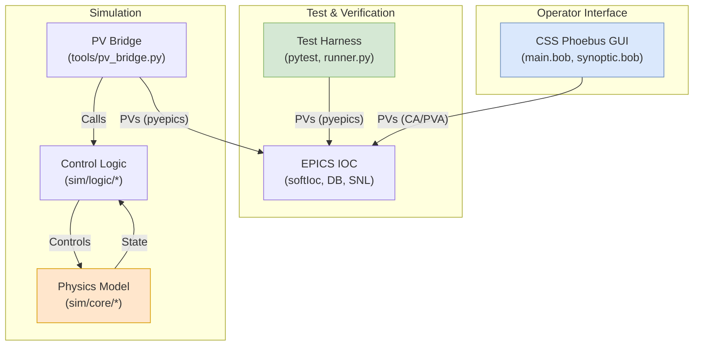

# DCM 크라이오 쿨러 시뮬레이터 (DCM Cryo Cooler Simulator)

[](./README.md)

본 프로젝트는 **DCM(Double Crystal Monochromator) 크라이오 쿨러**의 제어 로직을 설계, 검증 및 시연하기 위한 통합 시뮬레이션 환경입니다.

물리 모델 기반의 시뮬레이터, EPICS IOC, CSS Phoebus GUI, 자동화 테스트 하네스를 포함하여 실제 시스템과 유사한 환경에서 제어 알고리즘과 운영 절차를 안전하게 개발하고 검증하는 것을 목표로 합니다.

## 주요 특징 (Key Features)

- **상세 물리 모델**: Python으로 구현된 열역학 모델이 냉각, 가열, 열 부하, LN2 시스템 동작을 시뮬레이션합니다.
- **EPICS IOC 통합**: `softIoc` 기반의 EPICS IOC가 PV(Process Variable)를 통해 제어 인터페이스를 제공하며, 상태기계는 SNL(State Notation Language)로 구현되었습니다.
- **GUI (Rich GUI)**: CSS Phoebus를 사용하여 시스템 상태, 트렌드, 알람, P&ID를 시각화하는 대시보드를 제공합니다.
- **상태기계 기반 제어**: `OFF`, `INIT`, `PRECOOL`, `RUN`, `HOLD`, `WARMUP`, `SAFE_SHUTDOWN` 등 명확한 상태 전이를 통해 안정적인 운영을 보장합니다.
- **통합 테스트 하네스**: `pytest`와 YAML 기반 시나리오 러너를 통해 정상/비정상 상황, 인터락, 시스템 불변성을 자동으로 검증합니다.

## 시스템 아키텍처



## 디렉터리 구조

| 디렉터리 | 설명 |
|---|---|
| `DCM_CCV2App/` | EPICS IOC 애플리케이션 (DB, SNL 소스) |
| `iocBoot/iocDCM_CCV2/` | IOC 기동 스크립트 (`st.cmd`) |
| `sim/` | Python 기반 물리 시뮬레이터 코어 및 제어 로직 |
| `tools/` | EPICS-시뮬레이터 연동 브리지(`pv_bridge.py`) 및 유틸리티 |
| `gui/` | CSS Phoebus GUI 파일 (`.bob`) |
| `tests/` | 자동화 테스트 하네스 (시나리오, 프로퍼티 테스트, 실행기) |
| `docs/` | 개발 가이드, 분석 문서 등 프로젝트 관련 문서 |

## 빠른 시작 (Quick Start)

### 1. 사전 요구사항
- EPICS Base R7.0.x (SNCSEQ 모듈 포함)
- Python 3.10+
- CSS Phoebus

### 2. 설치 및 빌드

```bash
# 1. Python 가상환경 생성 및 활성화
python3 -m venv .venv
source .venv/bin/activate

# 2. 의존성 패키지 설치
pip install -r requirements.txt

# 3. EPICS IOC 빌드 (configure/RELEASE 경로 확인 후)
make -sj
```

### 3. 실행

각 컴포넌트를 별도의 터미널에서 실행합니다.

```bash
# 터미널 1: EPICS IOC 실행
cd iocBoot/iocDCM_CCV2
./st.cmd
```

```bash
# 터미널 2: 시뮬레이터-IOC 브리지 실행
# (가상환경 활성화된 상태)
python -m tools.pv_bridge
python -m tools.pv_bridge --verbose --log-interval 2.0
```

```bash
# 터미널 3: CSS Phoebus GUI 실행
phoebus -resource gui/bob/main.bob
```

이제 GUI를 통해 시스템을 제어하고 모니터링할 수 있습니다.

## 테스트

자동화된 테스트를 실행하여 시스템의 안정성을 검증할 수 있습니다.

```bash
# 단위/통합 테스트 실행
pytest

# 특정 시나리오 테스트 실행
python -m tests.tools.runner --plan tests/scenarios/normal_start.yaml
```

## 문서

프로젝트의 설계, 개발, 사용법에 대한 더 상세한 정보는 아래 문서들을 참고하세요.

- [**개발 가이드**](./docs/development_guide.md): 빌드, 실행, 테스트, 기여 방법에 대한 상세 절차를 안내합니다.
