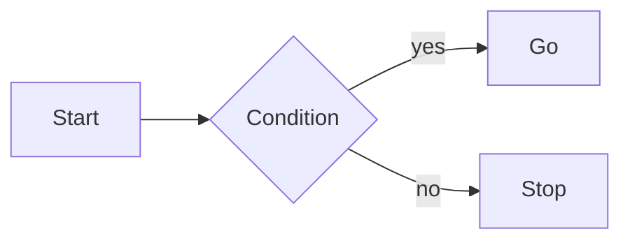

DCM Cryocooler Simulator – Diagrams

이 폴더는 현재 시스템의 주요 플로우/상태를 Mermaid 다이어그램으로 정리합니다.

다이어그램 목록
- Operating 상태기계: `docs/state_machine.mmd`
- Interlock 흐름: `docs/interlock_flow.mmd`
- 데이터 플로우(IOC/Bridge/Model/GUI/YAML): `docs/data_flow.mmd`
- 주요 PV 맵 개요: `docs/pv_map.mmd`

미리보기 방법
- VS Code용 Mermaid 플러그인 또는 Mermaid Live Editor에서 `.mmd` 파일을 여세요.
- Markdown 문서에 포함하려면 코드 블록으로 임베드합니다.

