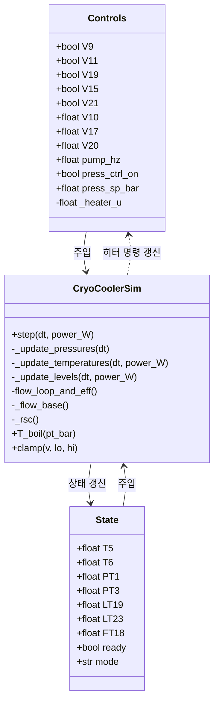

# `sim/core/dcm_cryo_cooler_sim.py` 분석

## 1. 문서 목적
이 문서는 브루커형 DCM 크라이오 쿨러의 이산 시뮬레이터 구현인 `sim/core/dcm_cryo_cooler_sim.py`의 구조와 동작을 정리합니다. 각 데이터 구조와 메서드가 어떤 역할을 수행하고 서로 어떻게 연결되는지 설명하여, 제어 로직 변경이나 모델 보정 시 참고 자료로 활용할 수 있도록 합니다.

## 2. 구성 요소 개요
- **데이터 클래스**
  - `Controls`: 밸브·펌프 설정과 압력 제어 상태를 보관하며, 히터 적분기(`_heater_u`)를 내부 상태로 유지합니다.
  - `State`: 센서에 해당하는 물리량(온도, 압력, 레벨, 유량)과 시퀀서 상태 플래그(`ready`, `mode`)를 담습니다.
- **시뮬레이터 본체**
  - `CryoCoolerSim`: 상수 파라미터(유량, 물성치, 감쇠 계수)를 클래스 속성으로 정의하고, `step()` 메서드에서 압력→온도→레벨 순으로 상태를 갱신합니다.

## 3. 데이터 클래스 세부 설명
### 3.1 `Controls`
| 필드 | 형식 | 설명 |
|------|------|------|
| `V9`, `V11`, `V19`, `V15`, `V21` | `bool` | 공급·환류·충전·HV 리필·퍼지 밸브 온/오프 플래그. |
| `V10`, `V17`, `V20` | `float` | 조절 밸브 개도(0.0~1.0). V10은 혼합밸브, V17은 루프 벤트, V20은 HV 벤트. |
| `pump_hz` | `float` | 순환 펌프 주파수(Hz). 0이면 루프가 정지합니다. |
| `press_ctrl_on` | `bool` | 압력 제어(히터 루프) 활성화 여부. 꺼지면 히터 명령이 리셋됩니다. |
| `press_sp_bar` | `float` | 히터 압력 제어 목표값(bar). |
| `_heater_u` | `float` | 내부 적분 상태(0~1). `_update_pressures()`에서만 갱신됩니다. |

### 3.2 `State`
| 필드 | 형식 | 설명 |
|------|------|------|
| `T5`, `T6` | `float` | 공급·리턴 라인 온도(K). |
| `PT1`, `PT3` | `float` | 루프·히터 압력(bar(g)). |
| `LT19`, `LT23` | `float` | 서브쿨러/히터 탱크 레벨(%) |
| `FT18` | `float` | 루프 유량(L/min). `flow_loop_and_eff()` 결과를 반영합니다. |
| `ready`, `mode` | `bool`, `str` | 상위 시퀀서 상태 전파용. 시뮬레이터 내부에서는 판정하지 않습니다. |

## 4. 시뮬레이터 상수
`CryoCoolerSim`은 시뮬레이터 전체에서 공유되는 물성치를 클래스 변수로 정의합니다. 주요 항목은 다음과 같습니다.

- **유량/물성치**: `Q80`, `rho`, `cp`, `ambK`, `delta_subcool` 등은 펌프·온도 응답을 계산할 때 사용합니다.
- **시간 상수/이득**: `k_tau`, `cooldown_tau_factor`, `tau_warm0`, `Kh`, `Kc`, `kv17`, `kv20`, `kv21`, `leak`은 압력·온도 피드백의 속도와 이득을 결정합니다.
- **레벨 모델**: `Vsub_L`, `Vhv_L`, `lt19_fill_lps`, `base_cons_Lps` 등은 서브쿨러와 히터 탱크에서의 충전·소비율을 정의합니다.
- **안전 한계**: `PSV_open_bar`, `max_bar`는 압력 클램프를 통해 수치적 안정성을 제공합니다.

## 5. 헬퍼 메서드
- `clamp(v, lo, hi)`: 모든 루틴에서 값 범위를 제한하는 공통 함수입니다.
- `T_boil(pt_bar)`: 압력 기반 질소 비등점을 추정합니다. 루프 온도 목표 계산에 활용됩니다.
- `_flow_base()`: 펌프 주파수와 V10 개도를 이용해 이론상 루프 유량을 계산합니다.
- `flow_loop_and_eff()`: 실제 루프 경로를 따라 흐르는 유량(`Q_loop`)과 냉각에 기여하는 유량(`Q_eff`)을 구분합니다.
- `_rsc()`: 서브쿨러 레벨(LT19)을 0~1 범위로 정규화하여 과냉도 인자로 사용합니다.

## 6. 상태 갱신 사이클
`step(dt, power_W)`은 다음 순서로 호출됩니다.
1. `_update_pressures(dt)`
2. `_update_temperatures(dt, power_W)`
3. `_update_levels(dt, power_W)`

각 단계는 동일한 `State` 인스턴스를 직접 수정하며, 중간 결과(예: `_heater_u`, `FT18`)를 다음 단계에서 활용합니다.

## 7. 압력 업데이트 로직
- 압력 제어가 켜져 있으면 `press_sp_bar`와 `PT3`의 오차를 적분하여 `_heater_u`를 0~1 범위에 유지합니다.
- 히터 출력(`_heater_u`)은 `Kh` 이득을 통해 `PT3` 상승률을 결정하고, V20 및 자연 누설(`leak`)은 `PT3`를 낮춥니다.
- 공급/환류 밸브와 펌프가 모두 동작하면 `PT3`-`PT1` 결합(`Kc`)이 활성화되어 루프 압력에 히터 영향이 전달됩니다.
- V17, V21 벤트는 `PT1`을 1 bar 방향으로 끌어내리며, 두 압력 모두 PSV 한계 이하로 클램프됩니다.

## 8. 온도 업데이트 로직
- `flow_loop_and_eff()` 결과를 `FT18`에 저장하여 외부에서 루프 유량을 관측할 수 있게 합니다.
- 서브쿨러 충전율(`Rsc`)은 공급 온도 목표 `T_supply_star = max(77 K, T_boil(PT1) − Δ_subcool·Rsc)` 계산에 사용됩니다.
- 퍼지(V21) 중이면서 저압이면 주변 온도(`ambK`)를 향해 지수적으로 복귀하고, 루프가 가동 중이면 `k_tau/Q_eff` 시간 상수를 적용합니다.
- 시퀀서가 `mode`를 `COOL*`로 설정하면 추가 가속 팩터(`cooldown_tau_factor`)가 적용됩니다.
- `T6`는 `T5`에 열부하를 반영하여 `ṁ·c_p`로 나눈 온도 상승을 더해 결정합니다.

## 9. 레벨 업데이트 로직
- 서브쿨러(LT19)는 기본 소비(`base_cons_Lps`), 열부하 비례 소비(`cons_coeff_Lps_perW`), 벤트 유량 손실(`gamma_vent_Lps_per_Lpm`)을 누적하고, V19가 열리면 보충(`lt19_fill_lps`)합니다.
- 히터 탱크(LT23)는 V15가 열릴 때 비율(`lt23_refill_rate_pctps`)로 충전되고, V17 벤트 개도에 비례한 배출(`lt23_drain_rate_pctps`)을 적용합니다.
- 추가 소비율은 기본 손실(`hv_base_cons_pctps`)에 히터 동작(`hv_heater_cons_pctps_max·_heater_u`)과 HV 벤트(`hv_vent_gamma_pctps·V20`) 효과를 더해 계산합니다.

## 10. 외부 연계
- 시퀀스 제어와 모드 전환은 `sim.logic.sequencer.Sequencer`가 담당하며, 시뮬레이터는 순수 물리 상태 계산에 집중합니다.
- IOC 브리지(`tools/pv_bridge.py`)나 테스트(`tests/tools/runner.py`)는 이 시뮬레이터를 호출하여 EPICS PV에 상태를 투영합니다.

## 11. Mermaid 다이어그램
다음 Mermaid 다이어그램은 데이터 구조와 메서드 호출 관계를 요약합니다.

> 원본 다이어그램 파일: [`docs/mermaid/dcm_cryo_cooler_sim_overview.mmd`](../mermaid/dcm_cryo_cooler_sim_overview.mmd)

## 12. 활용 팁
- 초기 상태/제어 입력을 바꿔가며 `sim.step(dt, power_W)`를 반복 호출하면 IOC 없이 모델 응답을 실험할 수 있습니다.
- 상수 파라미터를 튜닝한 경우 `docs/logic/dcm_cryo_cooler_sim.py`와의 차이를 비교하여 문서화합니다.

---
- 작성일: 2025-09-17
- 작성자: 프로젝트 문서화 팀
